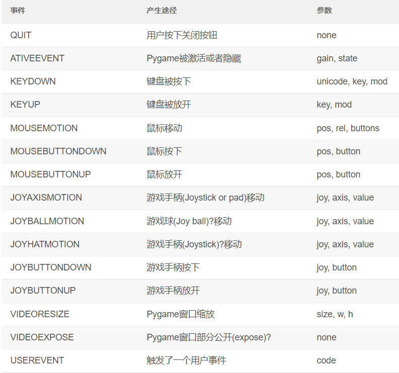

# 外星人入侵 
## 一、 安装Pygame
```
pip install pygame
```

## 二、 武装飞船

### 1. 开始游戏项目
  - 创建一个表示游戏的类，以创建空的Pygame窗口。`alien_invasion.py`
  -  常用事件集
    
  - `fill()`方法填充窗口背景色
  - 创建一个设置类。 `settings.py` 
    在Pygame中，原点(0,0)位于屏幕左上角
### 2. 添加飞船图像
  - 创建Ship类。  `ship.py`
  - 在屏幕上绘制飞船 
  - 重构：方法`_check_events()`和方法`_upadte_screen()`
### 3. 驾驶飞船
  - 驾驶飞船移动 修改`_check_events()`方法 
    注意`update()`方法中为两个`if`代码块
    注意窗口的大小限制，避免飞船移出屏幕
    可在`setting.py`中设置飞船移动速度
### 4. 射击
  - 创建一个子弹类。 `bullet.py`   
    删除消失的子弹(移动到窗口外)


## 二、外星人来了

### 1. 创建第一个外星人
  - 创建一个外星人类。 `alien.py`  
    `ALien`类不需要一个在屏幕上绘制外星人的方法，将使用一个`Pygame`编组方法来自动绘制外星人
  - 创建一个外星人实例
### 2. 创建一群外星人
### 3. 让外星人群移动 
  - `alien.py`中`update()`方法
### 4. 射杀外星人
  - `alien_invasion.py`中`_update_bullets()`方法检测外星人碰撞
  - 生成新的外星人群

### 5. 游戏结束
  - 检测外星人和飞船碰撞。 `alien_invasion.py`
  - 函数`spritecollideany()`接受两个实参：一个精灵和一个编组，它检查编组是否有成员 
    与精灵发生了碰撞，并在找到与精灵发生碰撞的成员后停止遍历编组。
  - 响应外星人与飞船碰撞    
    创建一个用于跟踪游戏统计的类`GameStats`。  `game_stats.py`
  - 检测外星人到达屏幕底端
  - 设置游戏状态标志

## 三、 记分

### 1. 添加`Play`按钮
  - 游戏开始时`game_active`处于非活动状态
  - 创建`Button`类。 `button.py`
    - `font.render()`将存储在`msg`中的文字转换为图像，再将图像存储在`self.msg_image`中
    - 方法`draw_button()`将按钮绘制到屏幕上
  - 在`alien_invasion.py`中创建Button类的实例
  - 在屏幕上绘制`Play`按钮
  - 响应点击`Play`事件 
  - 重置游戏
    - 在`alien_invasion.py`中添加`reset_stats()`方法
  - 修复``Play`按钮不可见的情况下，单击此区域仍重置游戏的问题
  - 游戏开始后隐藏光标,游戏结束后显示光标

### 2. 提高等级
  - 修改速度设置,增加难度
  - 在`alien_invasion.py`中的方法`_check_bullet_alien_collisions()`中，在整群外星人  
    都被消灭以后调用`increase_speed()`来加快游戏的节奏
  - 在重置游戏后要重置游戏速度

### 3. 记分
  - 在`reset_stats`中添加`score`记录分数，以便在每次开始游戏时都重置得分
  - 创建`ScoreBoard`类来显示得分。 `scoreboard..py`
  - 在游戏窗口中创建记分牌
    - 创建`Scoreboard`实例
    - 在窗口右上方绘制记分牌
  - 在外星人被消灭时更新得分
    - 为确保每次重置游戏每个外星人的分数值都被重置，故将`alien_score`设置 
      在`initialize_dynamic_settings()`方法中
  - 随游戏等级提高增加每个外星人分数
  - 将最高得分存储在`GameStats`中
  - 显示等级
    - 保证每次开始新游戏时都重置等级,在`reset_stats()`中初始化`self.level`
    - 显示等级
    - 显示玩家余下的飞船数
      - 修改类`Ship`，继承`Sprite`
      - 修改`Scoreboard`
    
    

